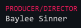
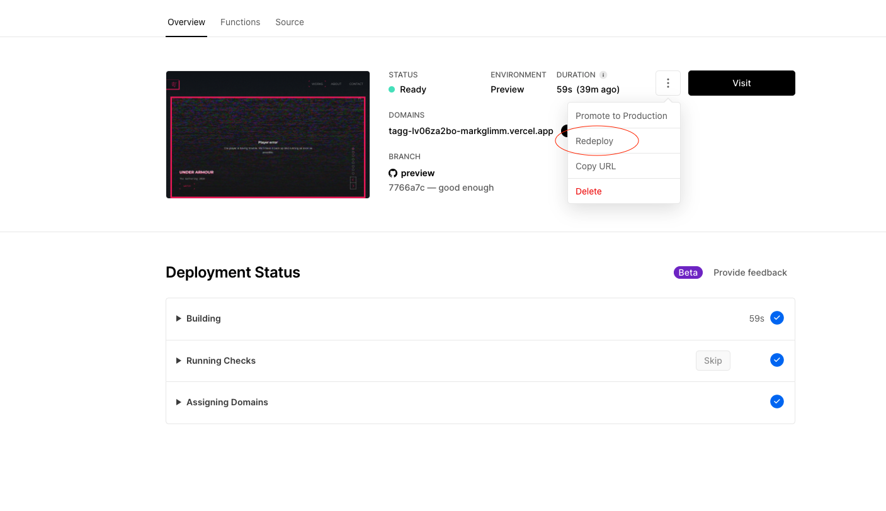

# `Video Content Management`

The video content of this site reads from specific sources in the [`vimeo.com/taggcreative`](vimeo.com/taggcreative) account. Please follow these directions to ensure all intended content loads properly. Each video the site uses require a JSON description.

> ### Note the commas and double quotes when writing descriptions! Last item of the JSON must _not_ have a comma. White space and newlines are ignored. For any problems with writing JSON,use this [validator](https://jsonlint.com/)

## **WORKS Section JSON Description**

The list of WORKS below the carousel get videos in the order that they appear:

- [`featured-works`](https://vimeo.com/manage/showcases/8478566/info)

Changes to the videos included in this showcase will be reflected in the WORKS section, as well as the individual WORKS page. Just like the clips, each video needs a JSON description in **_exactly_** this format:

```
{
  "client": "Client Name Here",
  "title": "Title of project here",
  "<Credit>": "<Person>",
  "<Credit>": "<Person>"
}
```

- **`client`** is the main drop shadow title
- **`title`** is the smaller, grey font of the title
- Any other fields included here will be shown as credits on the individual Work page. So for example `"Producer/Director":"Baylee Sinner"` will be rendered as:

  

## **Carousel Clips JSON Description**

The video carousel at the top of the page get videos from two showcases:

- [`featured-clips-16-9`](https://vimeo.com/manage/showcases/8493934/info) (for desktop screens)
- [`featured-clips-9-16`](https://vimeo.com/manage/showcases/8493940/info) (for mobile screens)

Changes to the videos included in this showcase will be reflected in the carousel. For all features to work properly, each clip (both sizes) needs a JSON description in **_exactly_** this format:

```
{
  "id": 1234567890,
  "client": "Client Name Here",
  "title": "Title of project here"
}
```

- **`id`** is the Vimeo ID of the full length video in `featured-works` that the "Watch" button goes to. The easiest way to find this ID is in the url when you are on the vimeo page for the video, ie `vimeo.com/manage/videos/1234567890`
- **`client`** is the main drop shadow title in the carousel
- **`title`** is the smaller, grey font of the title in the carousel

> ### Folder vs Showcase:
>
> A folder is a 'staging' area for new videos you are preparing for the site. A folder is where videos are _saved_ and showcase is where _selected_. If you delete a video from a folder, it will not be saved in the showcase, so be careful.

## **Adding New Videos**

Here is what to do when adding new content to the site's Vimeo folders:

1. Upload the full length video to `featured-works` **_folder_**. Provide a JSON description as described above.
2. Upload the clips for the video to `featured-works-16-9` and `featured-works-9-16` **_folders_**. Provide a JSON description as described above. (identical description for both sizes)
3. Go to the `featured-works` **_showcase_** and add the new video you uploaded. The order of the videos in this showcase will determine the list under WORKS on the site.
4. Go to both `featured-works-16-9` and `-9-16` **_showcases_** and add the new clips you uploaded in step 2. The order of the videos in this showcase determine the order of the clips in the carousel.
5. Make sure all video privacy settings are set to "Hide From Vimeo".
6. Final step, you need to redeploy the current production build. Go to the TAGG Vercel project page, find the current build that is in production, and hit `Redeploy`:



> ### Redploy!
>
> This site is _mostly_ a static website. Any new video content added in Vimeo will require a redploy. This is a no downtime action. The site **won't** need a redeploy for changes to already existing videos in the showcase.

## **Changing Copy / Team Content**

You can find the copy for the site inside the section files:
`components/sections`

### Who We Are

This section is a fixed styling, so adding more text may not style well.

### Core/Our Arena

There's 3 Text components where the copy can be edited. Also, adding more blocks of text here may not be positioned correctly.

### People/The Fam

These two sections work the same. There's a list at the top of the file that contains all the people for the section. You can add more people by adding to that list:

```
{
  given: "MARK",
  sur: "GLIMM",
  role: "Software Developer",
  head: "/images/extended-fam/Mark.png",
  mask: "/images/extended-fam/Mark copy.png",
  bio: "He made this obscenely detailed README",
}
```

`head` is the person's image, which needs to live in the `public/images/` somewhere, and referenced correctly.
`mask` is a copy of the same image, that has been altered to be fillec black. This is needed for the 'shadow' effect.

### OurRep

This section has a list of Client components, where you can add more clients by following the pattern. The client's svg must be in `public/clients/` folder.

### Contact

file: `components/ContactCard`
Pretty straight forward. Remember to change the `href` attribute if you intend the links to point elsewhere.

---

# `Developer Notes`

## Environment Variables

There are 4 environment variables that need to be in a file named `.env` at the root required for the project to work locally. You can get these variables from the Vercel project page:

- ACCESS_TOKEN
- CLIENT_ID
- CLIENT_SECRET
- TAGG_ID

## Deployments

The code for this project lives on Github at [TAGGCreative/TAGG](https://github.com/TAGGCreative/TAGG). The repository is linked to Vercel, and has two branches that will deploy automatically with each commit:

- `preview` builds to randomly generated, publically viewable links
- `main` builds to the project's main domain, www.taggcreative.com

# NextJS ReadME

This is a [Next.js](https://nextjs.org/) project bootstrapped with [`create-next-app`](https://github.com/vercel/next.js/tree/canary/packages/create-next-app).

## Getting Started

First, run the development server:

```bash
npm run dev
# or
yarn dev
```

Open [http://localhost:3000](http://localhost:3000) with your browser to see the result.

You can start editing the page by modifying `pages/index.js`. The page auto-updates as you edit the file.

[API routes](https://nextjs.org/docs/api-routes/introduction) can be accessed on [http://localhost:3000/api/hello](http://localhost:3000/api/hello). This endpoint can be edited in `pages/api/hello.js`.

The `pages/api` directory is mapped to `/api/*`. Files in this directory are treated as [API routes](https://nextjs.org/docs/api-routes/introduction) instead of React pages.

## Learn More

To learn more about Next.js, take a look at the following resources:

- [Next.js Documentation](https://nextjs.org/docs) - learn about Next.js features and API.
- [Learn Next.js](https://nextjs.org/learn) - an interactive Next.js tutorial.

You can check out [the Next.js GitHub repository](https://github.com/vercel/next.js/) - your feedback and contributions are welcome!

## Deploy on Vercel

The easiest way to deploy your Next.js app is to use the [Vercel Platform](https://vercel.com/new?utm_medium=default-template&filter=next.js&utm_source=create-next-app&utm_campaign=create-next-app-readme) from the creators of Next.js.

Check out our [Next.js deployment documentation](https://nextjs.org/docs/deployment) for more details.
